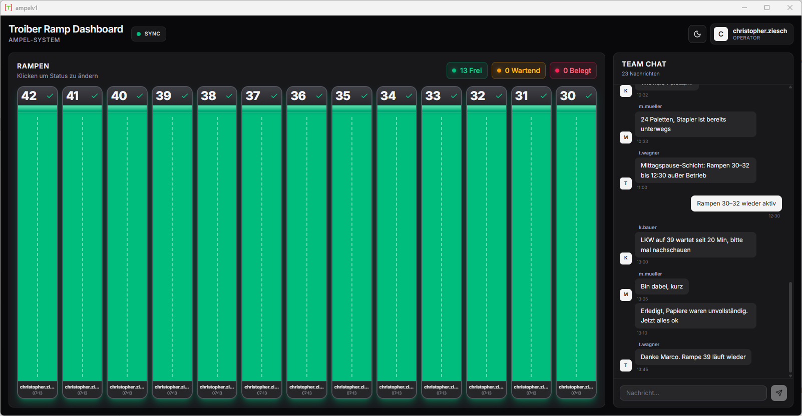
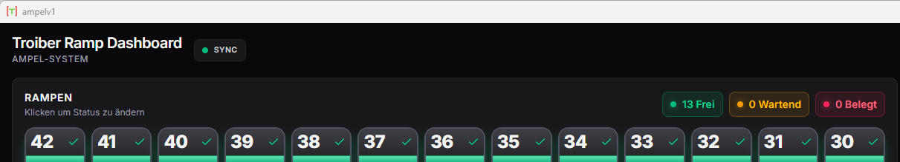
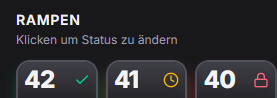
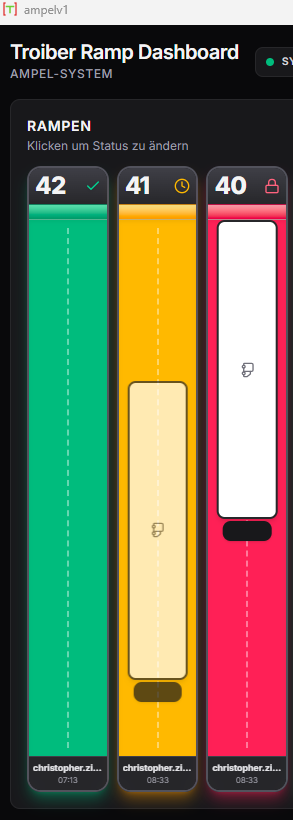
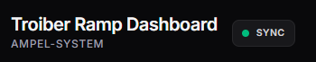
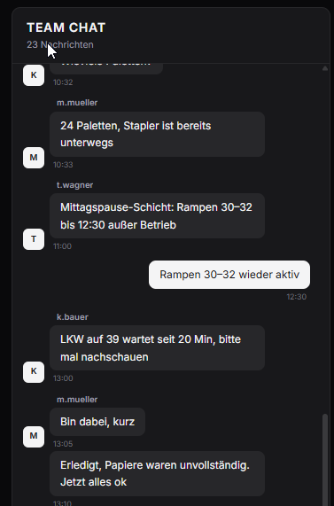
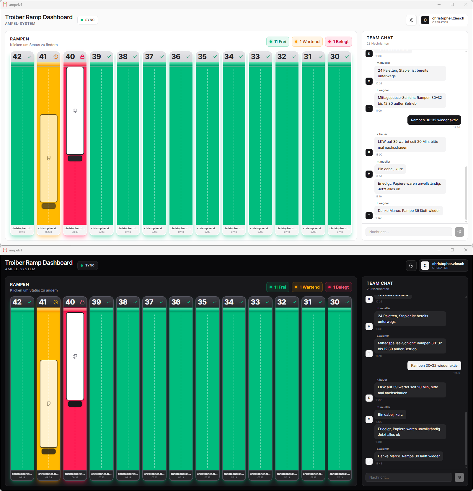
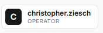

# Ramp Dashboard — Benutzerhandbuch

Dieses Handbuch beschreibt, wie Sie die Ramp-Dashboard-Anwendung im täglichen Hofbetrieb nutzen. Es richtet sich an Mitarbeiter:innen am Verladehof und am PC-Arbeitsplatz im Lager.

## Inhalt

1. [Auf einen Blick](#auf-einen-blick)
2. [Die Ampel-Farben](#die-ampel-farben)
3. [Status einer Rampe ändern](#status-einer-rampe-ändern)
4. [Die LKW-Anzeige](#die-lkw-anzeige)
5. [3-Sekunden-Sperre](#3-sekunden-sperre)
6. [Sync-Anzeige](#sync-anzeige)
7. [Team-Chat](#team-chat)
8. [Dunkler / Heller Modus](#dunkler--heller-modus)
9. [Ihr Benutzername](#ihr-benutzername)

---

## Auf einen Blick

Beim Öffnen des Programms sehen Sie ein Fenster mit drei Hauptbereichen:

- **Kopfzeile** oben — Titel, Sync-Anzeige, Modus-Umschalter und Ihr Benutzername.
- **Rampen-Übersicht** in der Mitte — die 13 Rampen (42 bis 30) als Verladehof-Draufsicht.
- **Team-Chat** rechts — Kurznachrichten an Ihre Kollegen.



---

## Die Ampel-Farben

Jede Rampe hat einen Status, der durch eine Farbe und ein Symbol dargestellt wird:

| Farbe | Bedeutung | Symbol |
|-------|-----------|--------|
| **Grün** (Frei) | Rampe ist frei und einsatzbereit. | Häkchen |
| **Gelb** (Wartend) | Ein LKW fährt zur Rampe oder rangiert. | Uhr |
| **Rot** (Belegt) | Ein LKW steht an der Rampe. Be- oder Entladung läuft. | Schloss |

Oben rechts in der Rampen-Übersicht sehen Sie eine Zusammenfassung, wie viele Rampen aktuell in welchem Status sind.



---

## Status einer Rampe ändern

Ein **Klick** auf eine Rampe schaltet sie zum nächsten Status weiter:

```
Frei → Wartend → Belegt → Frei → ...
```

Die Änderung ist sofort für alle anderen Mitarbeiter:innen am Standort sichtbar (innerhalb von ~1,5 Sekunden).



> **Tipp:** Hovern Sie mit der Maus über eine Rampe, um die hebende Animation zu sehen — so erkennen Sie, dass die Rampe anklickbar ist.

---

## Die LKW-Anzeige

Innerhalb jeder Rampe sehen Sie eine vereinfachte Draufsicht:

- **Die graue Wand oben** stellt das Lagergebäude mit der Rampennummer dar.
- **Der farbige Streifen** ist das Tor (in der Statusfarbe).
- **Der Hof darunter** ist die Anfahrt zur Rampe.
- **Der LKW** (weißer Anhänger + dunkles Führerhaus) erscheint, sobald die Rampe nicht mehr frei ist.

| Status | Wo steht der LKW? |
|--------|-------------------|
| **Frei** | Kein LKW sichtbar — der Hof ist leer. |
| **Wartend** | Der LKW steht weiter unten im Hof und pulsiert leicht — er nähert sich der Rampe. |
| **Belegt** | Der LKW steht direkt am Tor und ruht. |



---

## 3-Sekunden-Sperre

Sobald jemand den Status einer Rampe ändert, wird diese Rampe für **3 Sekunden** für alle Clients gesperrt. Während dieser Sperre:

- Sehen Sie ein dunkles Overlay mit einem rotierenden Lade-Symbol auf der Rampe.
- Klicks werden ignoriert.
- Andere Mitarbeiter:innen sehen die gleiche Sperre.

Diese Sperre verhindert, dass zwei Personen gleichzeitig denselben Status ändern und es zu Konflikten kommt.


---

## Sync-Anzeige

Oben in der Kopfzeile sehen Sie eine kleine Anzeige neben dem Titel:

- **Grüner Punkt + „Sync"** — Die Verbindung zum Netzlaufwerk steht. Alles wird synchron gehalten.
- **Roter Punkt + „Offline"** — Die Verbindung ist unterbrochen. Sie sehen ggf. veraltete Daten, und Klicks auf Rampen werden nicht gespeichert.



> **Bei „Offline":** Prüfen Sie zuerst Ihre Netzwerkverbindung. Bleibt das Problem länger bestehen, wenden Sie sich an Ihre IT-Abteilung. Ein Neustart der App ist meist nicht nötig — die Anzeige wechselt automatisch zurück auf „Sync", sobald die Verbindung wieder steht.

---

## Team-Chat

Rechts im Fenster befindet sich ein einfacher Chat-Bereich für kurze Absprachen mit Kollegen am Hof.

- Tippen Sie Ihre Nachricht in das Feld unten.
- Drücken Sie **Enter** oder klicken Sie auf den Senden-Pfeil.
- Eigene Nachrichten erscheinen rechts (dunkel), Nachrichten von Kollegen links (hell).
- Bei jedem neuen Tag wird ein Datums-Trenner eingefügt.



> **Hinweis:** Es werden die letzten 50 Nachrichten angezeigt; gespeichert werden bis zu 200. Ältere Nachrichten verschwinden automatisch.

---

## Dunkler / Heller Modus

Oben rechts neben Ihrem Benutzernamen finden Sie einen Schalter mit Sonne / Mond.

- **Klick auf die Sonne** → Wechsel in den dunklen Modus.
- **Klick auf den Mond** → Wechsel in den hellen Modus.

Die Wahl wird auf Ihrem Rechner gespeichert.



---

## Ihr Benutzername

Das Programm erkennt Ihren Windows-Benutzernamen automatisch und zeigt ihn oben rechts an. Dieser Name wird gespeichert, wann immer Sie:

- den Status einer Rampe ändern (sichtbar im Info-Streifen unter der Rampe), oder
- eine Chat-Nachricht senden.

Sie müssen sich nicht extra anmelden.



---

## Aufnahme-Checkliste für Screenshots

Speichern Sie alle Bilder unter `docs/images/`:

- [ ] `01-overview.png` — Gesamtansicht des Fensters bei verschiedenen Rampen-Status.
- [ ] `02-counts.png` — Nahaufnahme der drei Status-Chips (Frei / Wartend / Belegt) oben in der Rampen-Übersicht.
- [ ] `03-status-cycle.png` — Drei Rampen nebeneinander in Frei / Wartend / Belegt.
- [ ] `04-truck-states.png` — Drei Rampen mit dem LKW in den Zuständen leer / wartend / belegt.
- [ ] `05-locked.png` — Eine Rampe direkt nach einem Klick mit dem Lade-Overlay.
- [ ] `06-sync-indicator.png` — Sync-Anzeige in beiden Zuständen (idealerweise als Collage).
- [ ] `07-chat.png` — Chat-Bereich mit ein paar Beispielnachrichten von verschiedenen Personen.
- [ ] `08-theme-toggle.png` — Der Sonne/Mond-Schalter, ggf. zwei Bilder (heller / dunkler Modus).
- [ ] `09-user-badge.png` — Nahaufnahme der Benutzer-Anzeige oben rechts.
